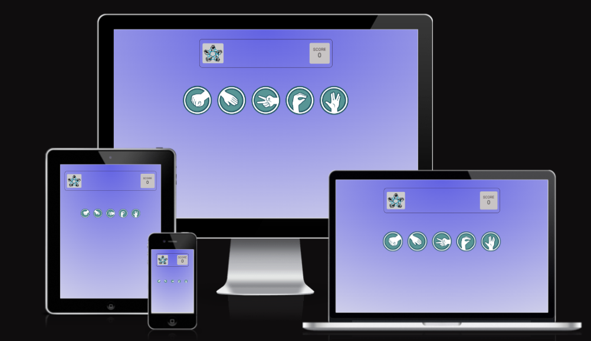
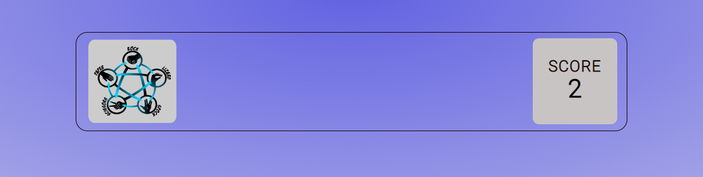
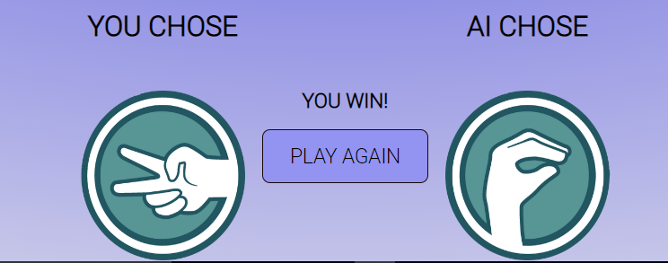
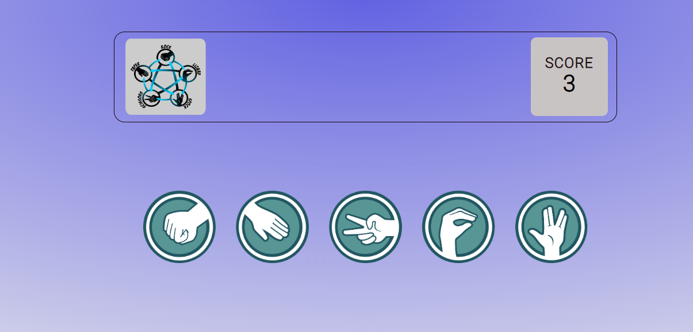
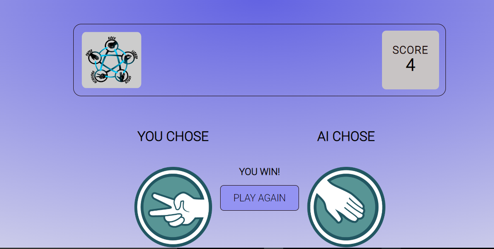
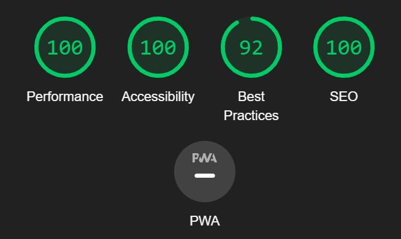

# Rock Paper Scissors Lizard Spock Game

## CONTENTS

* [Description](Description)

### Description
This game is an interesting game in which each player simultaneously forms one of five shapes with an outstretched hand. These shapes are "rock", "paper", "scissors" "lizard" and "spock". 
This game is accessible to anyone and also has the ability to play against the computer. It is made to be accessible on a range of devices.

[View the live project here.](http)

### User Experience (UX)
*  First Time Visitor Goals
   * Understand what the game is about using the rules guide.
   * Be able to navigate the game page.
   * Be able to interact with the game.

* Site Owner's goal
   * Provide a game with elements of chance.
   * Has a limited number of tries before the game is over.
   * Ability to play against the computer.
   * Have interactivity within the page.

### Features

#### Existing Features
* The Scoreboard
   * Featured throughout the game, the scoreboard contains the game logo and 
   the responsive score section that updates each time the game is play
   until the required number of tries.

   

* The Hands(choice) Area 
   * The features the various options a player is to choose from, ranging
   from rock, paper, scissors, lizard or spock. This feature is responsive when 
   hovered on and leads to a different page when one of the icons is clicked.

   

* The Rules Section
   * This section lays out the rules of the game, which new users can familiarise with
   before or while playing the game.   

* The Contest Area
   * This section does not display immediately the page loads, rather it is prompted
   by the click of the options icons. It features the Player, Computer, Play Again button and game output message.

   

* The Play Again Button
   * This button, when clicked, redirects the player back to the home page where the player will be allowed to play again. 
   the option of picking another hand or retrying the game.   

#### Preview of the Game Page on my PC

#### Features Left to Implement

### Technologies Used

#### Languages Used

* HTML5
* CSS3
* JAVASCRIPT

#### Libraries & Programs Used

1. Google Fonts:
   * The "**Roboto**" font was used throughout the project. This was imported 
    using Google fonts into the style.css file. The font sans-serif was used
    as the browser default font.

1. Hover.css:
   * This feature was used to give a transform effect on the hands icons thereby improving user experience/interactivity.

1. Git: 
   * Git was used for version control by utilizing the Gitpod terminal commands (git add, git commit -m "").

1. GitHub:
   * Also used for version control, deployment and hosting of this project.

1. Amiresponsive
   * The amiresponsive was used to test how responsive the game design looks across different browsers.  

1. Google Developer Tools
   * To troubleshoot and test features, check responsiveness and accessibility.   

### Testing   

#### W3C Validator

The [W3C](https://validator.w3.org/) validator was used to validate the index.html and styles.css files.

   * HTML
      * No errors were found when passed through the official [W3C validator](index.html).

   * CSS
      * No errors were found when passed through the official [Jigsaw validator](assets/css/style.css).   

#### JavaScript Validator

[Jshint](https://jshint.com/) was used to validate the script.js file.
   * Warnings:
   * Errors:

#### Lighthouse
   * Lighthouse within the Chrome Developer Tools was used to test the performance, accessibility, best practices and SEO of the game.

##### Desktop Analysis
 Achieved a score of 100% in three(3) except Best Practices which has a score of 92%.
    * Reason

##### Mobile Analysis
       

The game was tested using the following viewports:
   * Desktop: 1600x992px
   * Laptop: 1280x802px
   * Tablet: 768x1024px
   * Mobile: 320x480px

### Deployment

The game was deployed using GitHub Pages - 

Deploy the site using GitHub Pages:

1. Login (or signup) to Github.
1. Go to the repository for this project
1. Click the settings button.
1. Select pages in the left hand navigation menu.
1. From the source dropdown select main branch and press save.
1. The site has now been deployed, this process may take a few minutes before the site goes live.

### Credits

   * The game icons (rock, paper, scissors, lizard, spock) all enclosed(*class='hands'*) in the index.html file were all saved from [rwest88.github.io](rwest88.github.io).
   * Logo:
      * The project logo is credited to [geekcals.com](www.geekcals.com).
   * Code Institute Gitpod template  

### Resources

   * Code Institute materials on Comparative Programming and JavaScript Essentials.
   
### Acknowledgements
   * My Mentor for his continous helpful feeedback.
   * Tutor support at Code Institute for their support.      