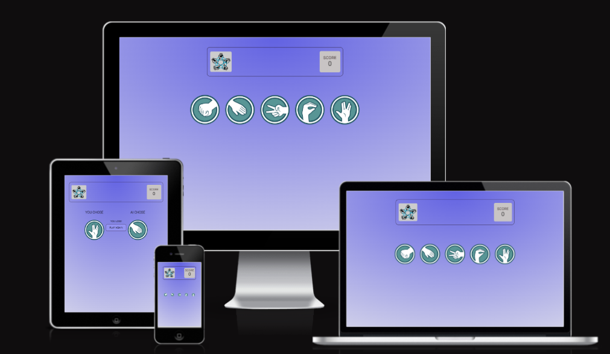
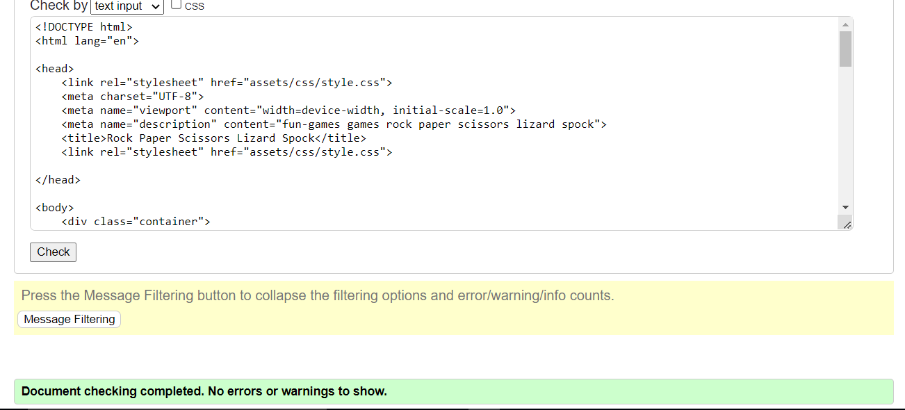
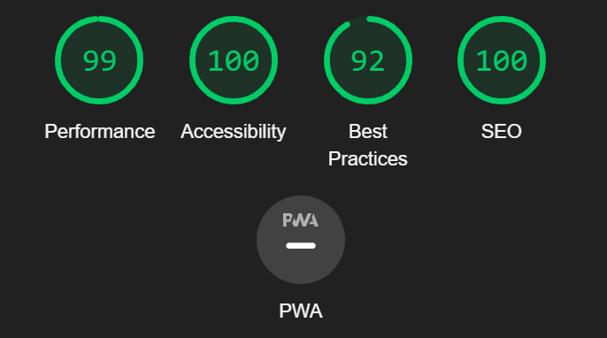
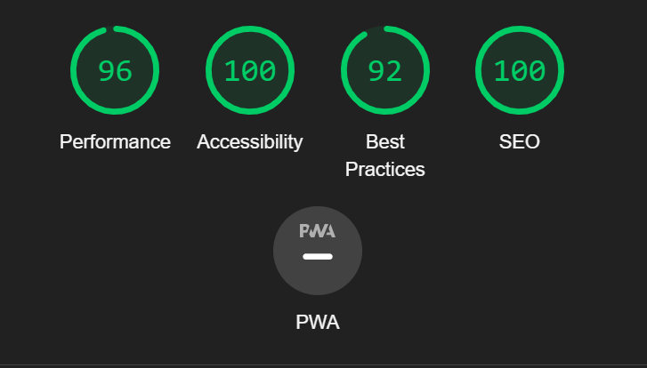

# Rock Paper Scissors Lizard Spock Game

### Description
This game is an interesting game in which each player simultaneously forms one of five shapes with an outstretched hand. These shapes are "rock", "paper", "scissors" "lizard" and "spock". 
This game is accessible to anyone and also has the ability to play against the computer. It is made to be accessible on a range of devices.

[View this site here](https://lucyagb.github.io/Rock-Paper-Scissors-Lizard-Spock/)

### User Experience (UX)
*  First Time Visitor Goals
   * Be able to navigate the game page.
   * Be able to interact with the game.

* Site Owner's goal
   * Provide a game with elements of chance.
   * Has a limited number of tries before the game is over.
   * Ability to play against the computer.
   * Have interactivity within the page.

### Rules of the game
  * Scissors cuts paper
  * Paper covers Rock
  * Rock crushes Lizard
  * Lizard poisons Spock
  * Spock smashes Scissors
  * Scissors decapitates Lizard
  * Lizard eats paper
  * Paper disproves Spock
  * Spock vapourizes Rock
  * Rock crushes scissors

  
### Features

#### Existing Features
* The Scoreboard
   * Featured throughout the game, the scoreboard contains the game logo and 
   the responsive score section that updates each time the game is play
   until the required number of tries.

   

* The Hands(choice) Area 
   * The features the various options a player is to choose from, ranging
   from rock, paper, scissors, lizard or spock. This feature is responsive when 
   hovered on and leads to a different page when one of the icons is clicked.

      

* The Contest Area
   * This section does not display immediately the page loads, rather it is prompted
   by the click of the options icons. It features the Player, Computer, Play Again button and game output message.

   

* The Play Again Button
   * This button, when clicked, redirects the player back to the home page where the player will be allowed to play again. 
   the option of picking another hand or retrying the game.   

#### Preview of the Game Page on my PC

#### Future features to implement
   * Add a message for the player when they exceed maximum number of tries.
   * Add the rules of the game.
   * Be able to view position of the player amongst winners board.

### Technologies Used

#### Languages Used

* HTML5
* CSS3
* JAVASCRIPT

### Color Scheme

The following colors were used for the design of the game:
   * Play Again Button Hover effect : rgb(200, 196, 196)
   * Borders : rgb(24, 8, 8);
   * Container: #030303 0%, #e4e4eb 100%

#### Libraries & Programs Used

1. Google Fonts:
   * The "**Roboto**" font was used throughout the project. This was imported 
    using Google fonts into the style.css file. The font sans-serif was used
    as the browser default font.

1. Hover.css:
   * This feature was used to give a transform effect on the hands icons thereby improving user experience/interactivity.

1. Git: 
   * Git was used for version control by utilizing the Gitpod terminal commands (git add, git commit -m "").

1. GitHub:
   * Also used for version control, deployment and hosting of this project.

1. Amiresponsive
   * The amiresponsive was used to test how responsive the game design looks across different browsers.  

1. Google Developer Tools
   * To troubleshoot and test features, check responsiveness and accessibility.   

### Testing   

#### W3C Validator

The [W3C](https://validator.w3.org/) validator was used to validate the index.html and styles.css files.

   * HTML
      * No errors were found when passed through the official W3C validator
       

   * CSS
      * No errors were found when passed through the official Jigsaw Validator
       

#### JavaScript Validator

[Jshint](https://jshint.com/) was used to validate the script.js file.
   * Warnings: Had 12 warnings. 	'let' and 'const' are available in ES6. It also stated that there are 2 unused variables, however these are being used.
   

#### Lighthouse
   * Lighthouse within the Chrome Developer Tools was used to test the performance, accessibility, best practices and SEO of the game.

##### Desktop Analysis
 Achieved a score of 100% in three(3) except Best Practices which has a score of 92%.
    * Reason

##### Mobile Analysis
 Achieved a score of 100% in Accessibility and SEO. 
 Scored 96% in Performance for the following reasons:
   * Serve image in next generation format
   * Properly size images
   * Images not having explicit width and height
 Scored 92% in best practices for the following reasons:
   * Displays images with incorrect aspect ratio

      * All these will be rectified in future implementation.

 

The game was tested using the following viewports:
   * Desktop: 1600x992px
   * Laptop: 1280x802px
   * Tablet: 768x1024px
   * Mobile: 320x480px

### Deployment

The game was deployed using GitHub Pages - 

Deploy the site using GitHub Pages: [View this site here](https://lucyagb.github.io/Rock-Paper-Scissors-Lizard-Spock/)

1. Login (or signup) to Github.
1. Go to the repository for this project
1. Click the settings button.
1. Select pages in the left hand navigation menu.
1. From the source dropdown select main branch and press save.
1. The site has now been deployed, this process may take a few minutes before the site goes live.

### Credits

   * The game icons (rock, paper, scissors, lizard, spock) all enclosed(*class='hands'*) in the index.html file were all saved from [rwest88.github.io](rwest88.github.io).
   * Logo:
      * The project logo is credited to [geekcals.com](www.geekcals.com).
   * Code Institute Gitpod template  

### Resources

   * Code Institute materials on Comparative Programming and JavaScript Essentials.
   
### Acknowledgements
   * My Mentor for his continous helpful feeedback.
   * Tutor support at Code Institute for their support.      